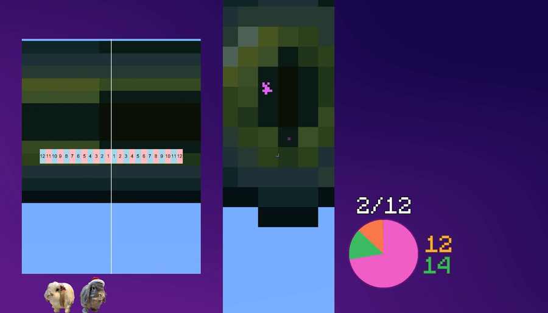

# Toolscreen

A screen mirroring and overlay tool for Minecraft Java Edition speedrunning. Resize your game, add overlays, and use EyeZoom — all without OBS projectors or leaving fullscreen.

> **Windows 10/11 only** · Fully legal for [speedrun.com](https://www.speedrun.com/mc) and [MCSR Ranked](https://mcsrranked.com/)

  

## Features

- **Screen Mirroring** — Mirror parts of your screen to other monitors or positions with configurable capture zones
- **EyeZoom** — Magnify the area around your crosshair for precise ender eye readings
- **Mode System** — Create presets (Fullscreen, Thin, Wide, EyeZoom, custom) and switch between them with hotkeys
- **Image Overlays** — Display images on top of your game (e.g. Ninjabrain Bot)
- **Window Overlays** — Capture and display any window directly in-game (e.g. a timer, Ninjabrain Bot)
- **Key Rebinding** — Remap keys and configure custom input behavior
- **Hotkey System** — Bind mode switching, overlay toggling, and sensitivity adjustments to any key

## Requirements

- **Windows 10 or 11** (x64 only — ARM64 not supported, macOS/Linux not supported)
- **Java 17+** (needed to run the installer)
- **Minecraft Java Edition**
- **Supported launchers:** Prism Launcher, MultiMC, MCSRLauncher

## Download

**[Download the latest release](https://github.com/jojoe77777/Toolscreen/releases/latest)**

You can download either the `.exe` or the `.jar` installer — both do the same thing.

## Installing

> Prefer video? Check out the [video guide](https://www.youtube.com/watch?v=YqS-fxPx_jo)

1. Download the [latest release](https://github.com/jojoe77777/Toolscreen/releases/latest)
2. Locate your instance folder:
   - **Prism Launcher**: right-click instance → "Folder"
   - **MultiMC**: right-click instance → "Instance Folder"
3. Copy the installer (`.exe` or `.jar`) into the instance folder and double-click it
4. Follow the on-screen instructions — **accept the Windows Defender exclusion prompts**

> If your antivirus blocks the install, temporarily disable it and try again. Toolscreen uses DLL injection which may trigger false positives.
5. Launch Minecraft and look for the Toolscreen popup in the top-left corner

## Configuration

Press <kbd>Ctrl</kbd> + <kbd>I</kbd> in fullscreen to open settings.

- **Basic Mode** — The most common settings, simplified for quick setup
- **Advanced Mode** — Full access to all features and fine-grained control

Hover over the `(?)` icons for tooltips explaining each setting.

## Uninstalling

Double-click the Toolscreen installer (`.jar` or `.exe`) and select **Uninstall**.

## Code signing policy

Free code signing provided by [SignPath.io](https://about.signpath.io/), certificate by [SignPath Foundation](https://signpath.org/).

The Windows release binaries built in this repository, including `Toolscreen.dll`, `liblogger_x64.dll`, and the packaged installers, are signed through the GitHub Actions + SignPath trusted-build flow.

- Repository owner: [jojoe77777](https://github.com/jojoe77777)
- Authors: [jojoe77777](https://github.com/jojoe77777)
- Committers: [jojoe77777](https://github.com/jojoe77777)
- Reviewers: [jojoe77777](https://github.com/jojoe77777)
- Approvers: [jojoe77777](https://github.com/jojoe77777)

This program will not transfer any information to other networked systems unless specifically requested by the user or the person installing or operating it.

When you use the optional downloader or release-update functionality, Toolscreen connects to GitHub release endpoints for this repository. That traffic is governed by the [GitHub General Privacy Statement](https://docs.github.com/en/site-policy/privacy-policies/github-general-privacy-statement).

## Community

Need help or want to share your setup? Join the [Discord server](https://discord.gg/A2v6bCJg6K).

## Building

Run the manual `Build Liblogger` GitHub Actions workflow once to publish the reusable logger assets. That workflow builds Linux `x64`/`x86`/`arm64`/`arm32`, Windows `x64`/`x86`/`arm64`, and a macOS universal `liblogger.dylib` containing both `x64` and `arm64`. Only the Windows `liblogger_x64.dll` is code-signed.

After that, run `build.bat` to build Toolscreen. The script downloads the latest signed `liblogger_x64.dll` and `liblogger_x64.pdb` from that workflow release, then stages them into `out/build/bin/Release/` alongside the Toolscreen artifacts.

If you intentionally need to rebuild liblogger locally instead of consuming the published signed artifact, configure CMake with `-DTOOLSCREEN_BUILD_LIBLOGGER_FROM_SOURCE=ON`.

For standalone logger artifacts on non-Windows hosts:

- `liblogger/build.sh` builds the Linux `.so` outputs into `liblogger/dist/linux/`
- `liblogger/build-macos.sh` builds the macOS `.dylib` output into `liblogger/dist/macos/`
